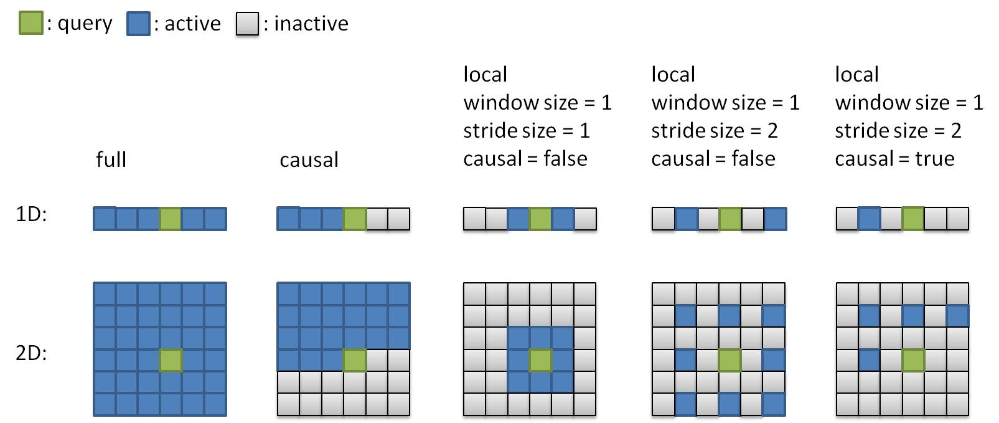
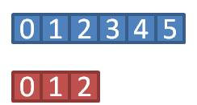
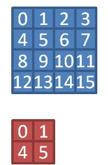
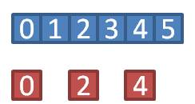
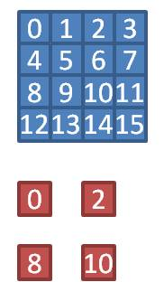
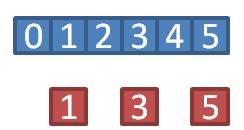
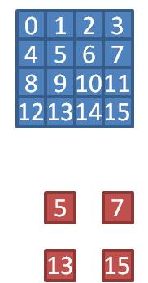

# tf_flash_attention
This is a [Tensorflow](https://www.tensorflow.org/) GPU kernel built upon the [CuTe](https://github.com/NVIDIA/cutlass/blob/main/media/docs/cpp/cute/00_quickstart.md) library, implementing the ideas proposed in [FlashAttention](https://arxiv.org/abs/2205.14135).

## Warning
1. While largely following the principle of memory-IO reduction and the algorithms described in the paper, this implementation is still based on my understanding of the proposed concepts and contains several design choices of my own; in fact, it has accidentally covered some of the tweaks suggested in [FlashAttention-2](https://arxiv.org/abs/2307.08691).  Please keep in mind the presence of discrepancies and the potential impact they have on the overall performance.
2. This implementation is solely focused on the attention mechanism itself; fusion of other functionalities (e.g. layer normalisation, dropout, etc.) is not included.
3. This implementation is not tuned for any specific GPU architectures, so the speed-up might not be able to reach the level reported by [FlashAttention](https://arxiv.org/abs/2205.14135).
4. The correctness of this implementation has only been verified with [unit tests](flash_attention/tests) and test cases from my other project; if you are interested in utilising this kernel, <ins>please make sure to test it against your use cases before deployment</ins>.
5. All my tests and runs of this kernel were performed on Ubuntu 22.04 with Tensorflow 2.15.1; other setups providing similar compiler/make utility support are expected to work, but have never been tested.

## Highlights
1. Supported floating-point types: half(float16), float, double.
1. Built-in support for 2d in addition to 1d sequences.
2. Rule-based masking to further reduce memory IO, where attention patterns are described by rules instead of masks read from memory. Rules that have been implemented include:
   * full      
   * causal      
   * local, with or without the causality rule
   
   Here are some examples of attention patterns translated from various rules \
   \
   
3. Adjustable synchronisation modes between two sequences of different sizes in corresponding dimensions to allow more flexibility over rule-based masking, of which the masking behaviour can be altered by aligning entries of two sequences differently. Currently supported modes are (with illustrative examples shown below, where aligned entries have the same indices):
   * none_front: Coordinates not scaled (step size = 1) and aligned at the front of each step along respective dimensions
      | 1d example | 2d example |
      | --- | --- |
      |  |  |
   * scale_front: Coordinates scaled per dimension ratios and aligned at the front of each step along respective dimensions
      | 1d example | 2d example |
      | --- | --- |
      |  |  |
   * scale_end: Coordinates scaled per dimension ratios and aligned at the end of each step along respective dimensions
      | 1d example | 2d example |
      | --- | --- |
      |  |  |   
 
4. Parallelisation over the batch, head and sequence dimension. This happens to coincide with the enhancement described in [FlashAttention-2](https://arxiv.org/abs/2307.08691), but is approached differently in this implementation.
5. As a standalone pip package

## Notes
1. This kernel expects input tensors in channel-first format, simply for the convenience of memory manipulation and bank-conflict prevention. While this is not the default format set in Tensorflow, the assumption is that in most cases there should be one projection before (to create feature maps of query, key, and value) and after (to combine output from all heads) the invocation of this kernel, respectively, so switching between channel-first/channel-last formats can be done alongside those projections with only a neglectable or no penalty by operations like einsum().
2. Despite targeting no specific GPU architectures, to gain access to hexp(), which is the half-precision version of exp(), kernel compilation is explicitly configured to request minimum support for CC 5.3 rather than the default.

## Build/Install
Once cloned/downloaded, this project can be built/installed through pip frontend:
```shell
# in the root folder of this project
pip install -v -e ./
```
for installation in editable mode, or
```shell
pip install -v ./
```
for normal installation. You could also build the shared object of the kernel directly, by:
```shell
cd flash_attention/kernel
make
```
which is particularly useful in editable mode, allowing kernel recompilation after code modification without reinstallation.

## Usage
Interfaces wrapping actual kernel calls are provided in [flash_attention.py](flash_attention/flash_attention.py), and here is a quick example of performing local attention on 1d sequences:
```python
import tensorflow as tf
from flash_attention import flash_attention
# shape format = [batch, channel, sequence]
Q = tf.random.uniform([8, 32, 1024])
K = tf.random.uniform([8, 32, 2048])
V = tf.random.uniform([8, 16, 2048])

# O is of a shape = [8, 16, 1024]
O = flash_attention.local_1d(Q, K, V, window_size=32, log2_stride_size=0, is_causal=False, sync_mode='scale_front')
```
You could also check `help(flash_attention)` for detailed interface documentation.

## To-do
1. ~~Substituting the "swizzle" trick for "padding" to tackle bank-conflict with better shared-memory efficiency.~~ \
   Having tried to implement the swizzle trick via cute::Swizzle provided by CuTe library; however, it seems that the cost of address manipulation incurred whenever a swizzled memory location gets accessed outweighs the benefit of extra memory saved from padding, as my test has shown a slight slowdown with this swizzle trick. For that reason, this currently remains an opt-in feature, and can only be manually enabled by setting the compile flag *BANK_CONFLICT_FREE_BY_SWIZZLING* when compiling the kernel shared object.
3. Including tweaks proposed in [FlashAttention-2](https://arxiv.org/abs/2307.08691)
